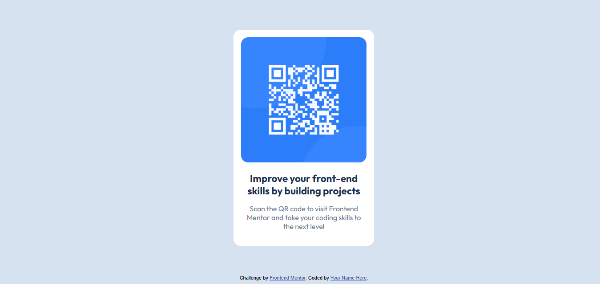

# Frontend Mentor - QR code component solution

This is a solution to the [QR code component challenge on Frontend Mentor](https://www.frontendmentor.io/challenges/qr-code-component-iux_sIO_H). Frontend Mentor challenges help you improve your coding skills by building realistic projects. 

## Table of contents

- [Frontend Mentor - QR code component solution](#frontend-mentor---qr-code-component-solution)
  - [Table of contents](#table-of-contents)
  - [Overview](#overview)
    - [Screenshot](#screenshot)
    - [Links](#links)
  - [My process](#my-process)
    - [Built with](#built-with)
    - [What I learned](#what-i-learned)
    - [Useful resources](#useful-resources)
  - [Author](#author)

## Overview

### Screenshot

.png)
.png)

### Links

- Solution URL: [github repo](https://github.com/amadoch/FMQRComponentPage)
- Live Site URL: 

## My process
first I focused in implement the design styles (thus any about the color and fonts), later I'm focused the structere of the page which no take so much time cause is a more simple component but, I'm totally sure I spend more in the css, specifically in how center the elements and this take me to think: "why i not use grid and not media to have the same effect in less code?", so it's work and play around until get the solution.

### Built with

- Semantic HTML5 markup
- CSS custom properties
- Flexbox
- Grid
- Mobile-first workflow

### What I learned
I learn the use of grid can simplify much more the centering of elements, this helpful if you want to have components or page with a partially easy structure in a cuestion of minutes, the use of media-queries is more for build more complex ones and it more enfocated in the behavior of the page on one of this screen (of queries selected by the way...).

### Useful resources

- [Modzilla Developer Network](https://developer.mozilla.org/en-US/docs/Web/CSS) - This helped me for research any info about css and html. I really liked this platform, and will use it going forward becuase they have a lot more content about web development.
- [Vercel](https://vercel.com/home) - Easy to use and deploy pages from github, but make sure they static.

## Author

- Website - [amadoch](https://github.com/amadoch)
- Frontend Mentor - [@amadoch](https://www.frontendmentor.io/profile/amadoch)
